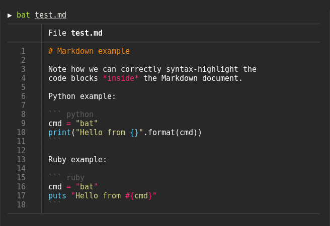

## 目录查看`eza`

`ls`命令增强，彩色文字，文件图标。
- 主页: [Github](https://github.com/eza-community/eza)
- 平台:    

## 快速目录切换`zoxide`

`cd`命令增强，支持目录记忆、模糊搜索
- 主页: [Github](https://github.com/ajeetdsouza/zoxide)
- 平台:    

## 文件内容查看`bat`

`cat`命令增强, 语法高亮、Git改动、特殊符号显示
- 主页: [Github](https://github.com/sharkdp/bat)
- 平台:    

## 文件名查找`fd`

`find`增强
- 主页: [Github](https://github.com/sharkdp/fd)
- 平台:    

## 文件内容查找`rg`

`grep`命令增强, 
- 主页: [Github](https://github.com/BurntSushi/ripgrep)
- 平台:    

## 交互式搜索神器`fzf`

- 主页: [Github](https://github.com/junegunn/fzf)
- 平台:    

## 终端资源管理器`yazi`

- 主页: [Github](https://github.com/sxyazi/yazi)
- 平台:    

## 终端提示符美化`starship`

- 主页: [官网](https://starship.rs/zh-cn/)
- 平台:    

