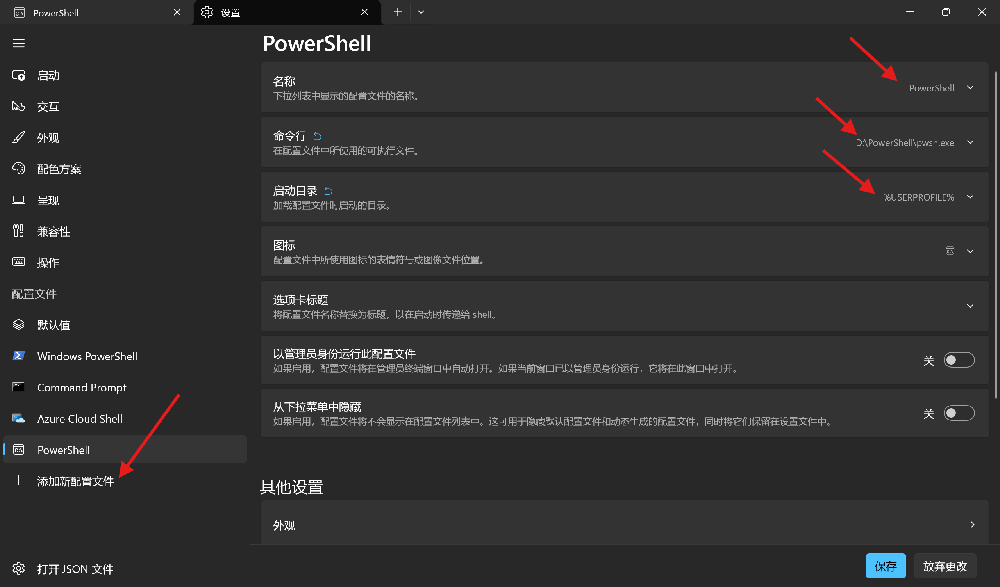
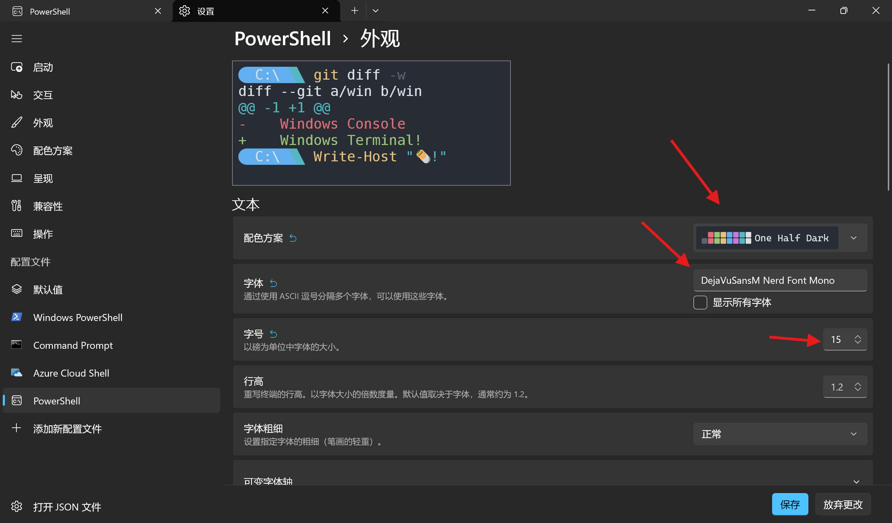

## 一、安装

### Windows 11

新版本Windows 11默认自带Windows Terminal，可直接在开始菜单搜索`终端`

### Windows 10

1. [微软商店 Windows Terminal](https://apps.microsoft.com/detail/9n0dx20hk701?hl=zh-CN&gl=CN)
2. [Github Release](https://github.com/microsoft/terminal/releases)下载最新版本安装即可（建议选择免安装的zip版本，解压即用）

## 二、配置

### 1. 基础配置

#### NerdFont字体安装

[NerdFont](https://www.nerdfonts.com/font-downloads)选一个自己喜欢的字体下载并安装（解压后右键点击安装）

#### Powershell安装

[Github Release](https://github.com/PowerShell/PowerShell/releases)下载最新版本安装即可（建议选择免安装的zip版本，解压即用），不推荐使用windows自带的windows powershell，版本过老。

#### 终端界面配置

根据自己的需求按下图配置





### 2. 美化

终端美化使用[Starship](https://starship.rs/zh-CN/)，相比Oh-My-Posh仅支持Windows，Starship支持各类操作系统，跨平台体验一致。且使用rust开发，性能更加优异。

[Github Release](https://github.com/starship/starship/releases)下载最新版本二进制文件，并添加环境变量。

#### 配置PowerShell

终端启动上面新配置的Powershell，执行以下命令，打开PowerShell配置文件

```powershell
notepad $PROFILE
```


记事本提示未找到配置文件，是否新建？点击创建



将以下内容添加到文件末尾，保存退出
```powershell
Invoke-Expression (&starship init powershell)
```

重新打开Powershell，此时Starship已生效，终端提示符变更为Starship默认样式

#### 配置Sharship

详细配置参考[官方配置文档](https://starship.rs/zh-cn/config/)

Sharship提供了多种预设主题，可以直接更换，我更喜欢[Tokyo Night Preset](https://starship.rs/zh-CN/presets/tokyo-night)

```powershell
# 可使用如下命令配置
starship preset tokyo-night -o ~/.config/starship.toml
```
