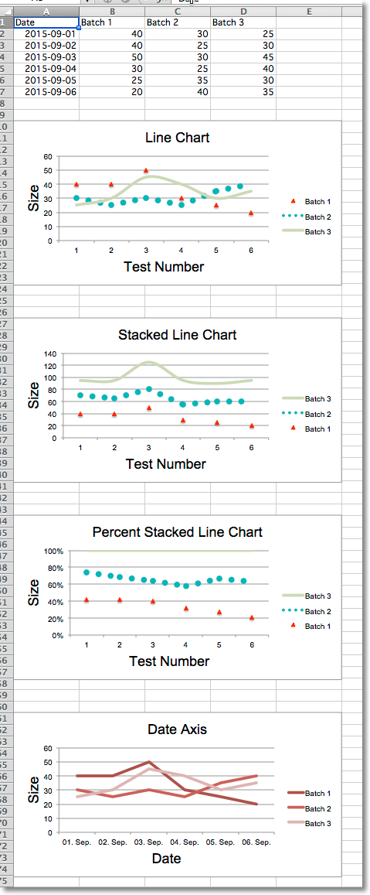
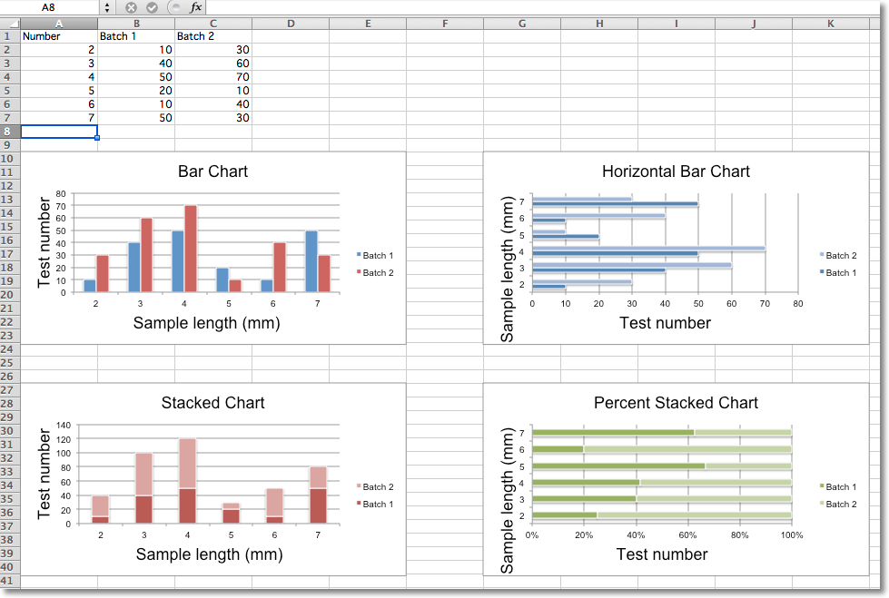
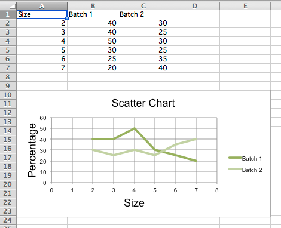
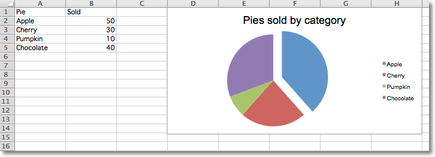
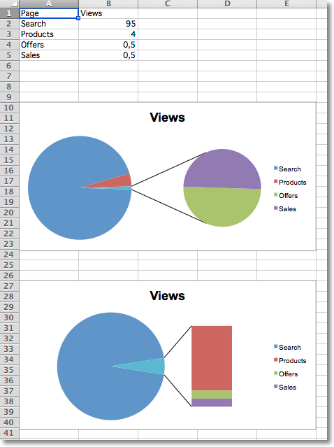
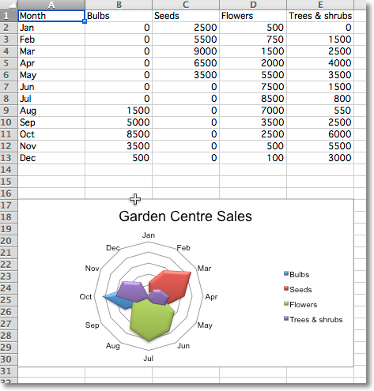

## 折线图
```python
from datetime import date

from openpyxl import Workbook
from openpyxl.chart import (
    LineChart,
    Reference,
)
from openpyxl.chart.axis import DateAxis

wb = Workbook()
ws = wb.active

rows = [
    ['Date', 'Batch 1', 'Batch 2', 'Batch 3'],
    [date(2015,9, 1), 40, 30, 25],
    [date(2015,9, 2), 40, 25, 30],
    [date(2015,9, 3), 50, 30, 45],
    [date(2015,9, 4), 30, 25, 40],
    [date(2015,9, 5), 25, 35, 30],
    [date(2015,9, 6), 20, 40, 35],
]

for row in rows:
    ws.append(row)

c1 = LineChart()
c1.title = "Line Chart"
c1.style = 13
c1.y_axis.title = 'Size'
c1.x_axis.title = 'Test Number'

data = Reference(ws, min_col=2, min_row=1, max_col=4, max_row=7)
c1.add_data(data, titles_from_data=True)

# Style the lines
s1 = c1.series[0]
s1.marker.symbol = "triangle"
s1.marker.graphicalProperties.solidFill = "FF0000" # Marker filling
s1.marker.graphicalProperties.line.solidFill = "FF0000" # Marker outline

s1.graphicalProperties.line.noFill = True

s2 = c1.series[1]
s2.graphicalProperties.line.solidFill = "00AAAA"
s2.graphicalProperties.line.dashStyle = "sysDot"
s2.graphicalProperties.line.width = 100050 # width in EMUs

s2 = c1.series[2]
s2.smooth = True # Make the line smooth

ws.add_chart(c1, "A10")

from copy import deepcopy
stacked = deepcopy(c1)
stacked.grouping = "stacked"
stacked.title = "Stacked Line Chart"
ws.add_chart(stacked, "A27")

percent_stacked = deepcopy(c1)
percent_stacked.grouping = "percentStacked"
percent_stacked.title = "Percent Stacked Line Chart"
ws.add_chart(percent_stacked, "A44")

# Chart with date axis
c2 = LineChart()
c2.title = "Date Axis"
c2.style = 12
c2.y_axis.title = "Size"
c2.y_axis.crossAx = 500
c2.x_axis = DateAxis(crossAx=100)
c2.x_axis.number_format = 'd-mmm'
c2.x_axis.majorTimeUnit = "days"
c2.x_axis.title = "Date"

c2.add_data(data, titles_from_data=True)
dates = Reference(ws, min_col=1, min_row=2, max_row=7)
c2.set_categories(dates)

ws.add_chart(c2, "A61")

wb.save("line.xlsx")
```



## 柱状图
```python
from openpyxl import Workbook
from openpyxl.chart import BarChart, Series, Reference

wb = Workbook(write_only=True)
ws = wb.create_sheet()

rows = [
    ('Number', 'Batch 1', 'Batch 2'),
    (2, 10, 30),
    (3, 40, 60),
    (4, 50, 70),
    (5, 20, 10),
    (6, 10, 40),
    (7, 50, 30),
]


for row in rows:
    ws.append(row)


chart1 = BarChart()
chart1.type = "col"
chart1.style = 10
chart1.title = "Bar Chart"
chart1.y_axis.title = 'Test number'
chart1.x_axis.title = 'Sample length (mm)'

data = Reference(ws, min_col=2, min_row=1, max_row=7, max_col=3)
cats = Reference(ws, min_col=1, min_row=2, max_row=7)
chart1.add_data(data, titles_from_data=True)
chart1.set_categories(cats)
chart1.shape = 4
ws.add_chart(chart1, "A10")

from copy import deepcopy

chart2 = deepcopy(chart1)
chart2.style = 11
chart2.type = "bar"
chart2.title = "Horizontal Bar Chart"

ws.add_chart(chart2, "G10")

chart3 = deepcopy(chart1)
chart3.type = "col"
chart3.style = 12
chart3.grouping = "stacked"
chart3.overlap = 100
chart3.title = 'Stacked Chart'

ws.add_chart(chart3, "A27")

chart4 = deepcopy(chart1)
chart4.type = "bar"
chart4.style = 13
chart4.grouping = "percentStacked"
chart4.overlap = 100
chart4.title = 'Percent Stacked Chart'

ws.add_chart(chart4, "G27")

wb.save("bar.xlsx")
```


## 散点图
```python
from openpyxl import Workbook
from openpyxl.chart import (
    ScatterChart,
    Reference,
    Series,
)

wb = Workbook()
ws = wb.active

rows = [
    ['Size', 'Batch 1', 'Batch 2'],
    [2, 40, 30],
    [3, 40, 25],
    [4, 50, 30],
    [5, 30, 25],
    [6, 25, 35],
    [7, 20, 40],
]

for row in rows:
    ws.append(row)

chart = ScatterChart()
chart.title = "Scatter Chart"
chart.style = 13
chart.x_axis.title = 'Size'
chart.y_axis.title = 'Percentage'

xvalues = Reference(ws, min_col=1, min_row=2, max_row=7)
for i in range(2, 4):
    values = Reference(ws, min_col=i, min_row=1, max_row=7)
    series = Series(values, xvalues, title_from_data=True)
    chart.series.append(series)

ws.add_chart(chart, "A10")

wb.save("scatter.xlsx")
```


## 饼图
```python
from openpyxl import Workbook

from openpyxl.chart import (
    PieChart,
    ProjectedPieChart,
    Reference
)
from openpyxl.chart.series import DataPoint

data = [
    ['Pie', 'Sold'],
    ['Apple', 50],
    ['Cherry', 30],
    ['Pumpkin', 10],
    ['Chocolate', 40],
]

wb = Workbook()
ws = wb.active

for row in data:
    ws.append(row)

pie = PieChart()
labels = Reference(ws, min_col=1, min_row=2, max_row=5)
data = Reference(ws, min_col=2, min_row=1, max_row=5)
pie.add_data(data, titles_from_data=True)
pie.set_categories(labels)
pie.title = "Pies sold by category"

# Cut the first slice out of the pie
slice = DataPoint(idx=0, explosion=20)
pie.series[0].data_points = [slice]

ws.add_chart(pie, "D1")

ws = wb.create_sheet(title="Projection")

data = [
    ['Page', 'Views'],
    ['Search', 95],
    ['Products', 4],
    ['Offers', 0.5],
    ['Sales', 0.5],
]

for row in data:
    ws.append(row)

projected_pie = ProjectedPieChart()
projected_pie.type = "pie"
projected_pie.splitType = "val" # split by value
labels = Reference(ws, min_col=1, min_row=2, max_row=5)
data = Reference(ws, min_col=2, min_row=1, max_row=5)
projected_pie.add_data(data, titles_from_data=True)
projected_pie.set_categories(labels)

ws.add_chart(projected_pie, "A10")

from copy import deepcopy
projected_bar = deepcopy(projected_pie)
projected_bar.type = "bar"
projected_bar.splitType = 'pos' # split by position

ws.add_chart(projected_bar, "A27")

wb.save("pie.xlsx")
```




## 环形图
```python
from openpyxl import Workbook

from openpyxl.chart import (
    DoughnutChart,
    Reference,
    Series,
)
from openpyxl.chart.series import DataPoint

data = [
    ['Pie', 2014, 2015],
    ['Plain', 40, 50],
    ['Jam', 2, 10],
    ['Lime', 20, 30],
    ['Chocolate', 30, 40],
]

wb = Workbook()
ws = wb.active

for row in data:
    ws.append(row)

chart = DoughnutChart()
labels = Reference(ws, min_col=1, min_row=2, max_row=5)
data = Reference(ws, min_col=2, min_row=1, max_row=5)
chart.add_data(data, titles_from_data=True)
chart.set_categories(labels)
chart.title = "Doughnuts sold by category"
chart.style = 26

# Cut the first slice out of the doughnut
slices = [DataPoint(idx=i) for i in range(4)]
plain, jam, lime, chocolate = slices
chart.series[0].data_points = slices
plain.graphicalProperties.solidFill = "FAE1D0"
jam.graphicalProperties.solidFill = "BB2244"
lime.graphicalProperties.solidFill = "22DD22"
chocolate.graphicalProperties.solidFill = "61210B"
chocolate.explosion = 10

ws.add_chart(chart, "E1")

from copy import deepcopy

chart2 = deepcopy(chart)
chart2.title = None
data = Reference(ws, min_col=3, min_row=1, max_row=5)
series2 = Series(data, title_from_data=True)
series2.data_points = slices
chart2.series.append(series2)

ws.add_chart(chart2, "E17")

wb.save("doughnut.xlsx")
```


## 雷达图

```python
from openpyxl import Workbook
from openpyxl.chart import RadarChart, Reference

wb = Workbook()
ws = wb.active

rows = [
    ['Month', "Bulbs", "Seeds", "Flowers", "Trees & shrubs"],
    ['Jan', 0, 2500, 500, 0,],
    ['Feb', 0, 5500, 750, 1500],
    ['Mar', 0, 9000, 1500, 2500],
    ['Apr', 0, 6500, 2000, 4000],
    ['May', 0, 3500, 5500, 3500],
    ['Jun', 0, 0, 7500, 1500],
    ['Jul', 0, 0, 8500, 800],
    ['Aug', 1500, 0, 7000, 550],
    ['Sep', 5000, 0, 3500, 2500],
    ['Oct', 8500, 0, 2500, 6000],
    ['Nov', 3500, 0, 500, 5500],
    ['Dec', 500, 0, 100, 3000 ],
]

for row in rows:
    ws.append(row)

chart = RadarChart()
# standard, mark, filled
chart.type = "filled"
labels = Reference(ws, min_col=1, min_row=2, max_row=13)
data = Reference(ws, min_col=2, max_col=5, min_row=1, max_row=13)
chart.add_data(data, titles_from_data=True)
chart.set_categories(labels)
chart.style = 26
chart.title = "Garden Centre Sales"
chart.y_axis.delete = True

ws.add_chart(chart, "A17")

wb.save("radar.xlsx")
```


